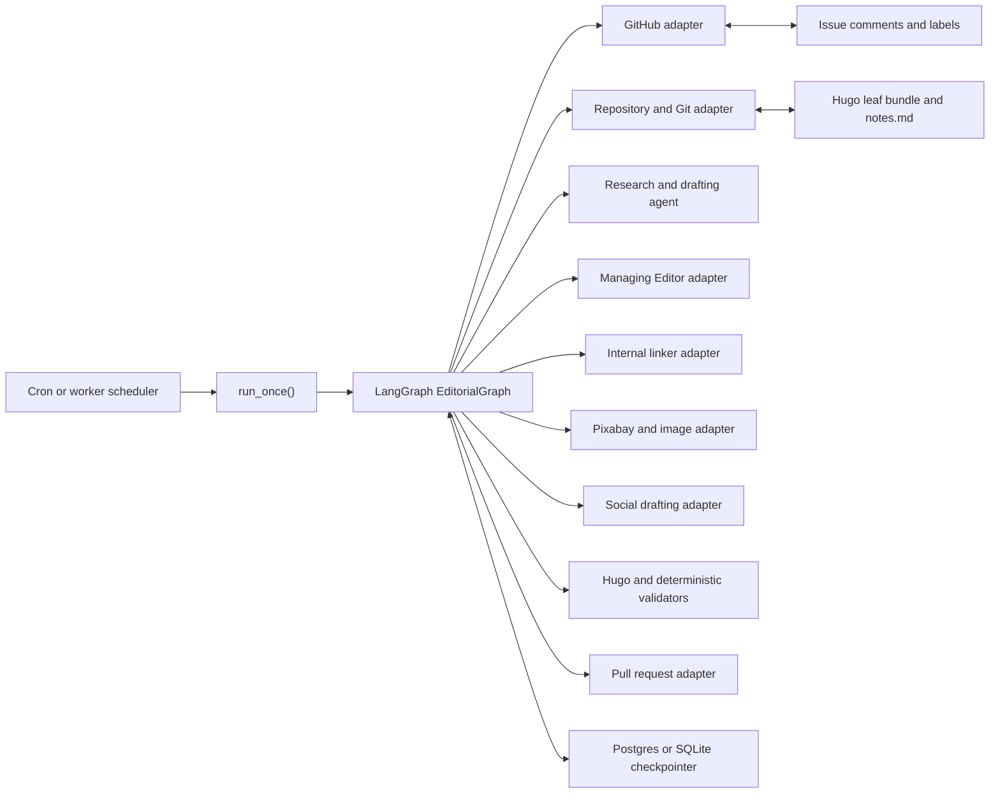
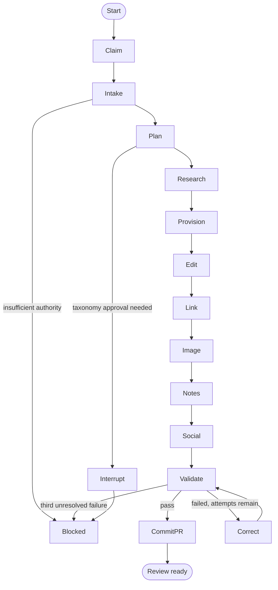

# Editorial Agent: LangChain Implementation Specification and Plan

**Status:** Proposed implementation specification  
**Target runtime:** Python, LangChain, and LangGraph  
**Source of truth:** [Editorial Agent PRD](editorial-agent-prd.md) and the repository implementation in `.agents/skills/editorial-agent/`

## 1. Purpose

Implement the CEO Playbook Editorial Agent as an executable Python service that turns one eligible GitHub editorial backlog issue into a review-ready Hugo draft package.

The service must preserve the operating contract already proven in Codex:

- Claim one `editorial:ready` issue at a time.
- Create or reuse the issue branch and Hugo leaf bundle.
- Research, draft, edit, source an image, add internal links, and generate social candidates.
- Keep `draft: true` in all cases.
- Validate the result, make at most two targeted correction passes, and open a linked PR.
- Stop before merge, publication, or social posting.

The LangChain implementation is not a second editorial policy. It is an executable adapter for the existing policy, skills, Hugo validators, and GitHub state model.

## 2. Design decision

Use LangChain for model access, structured outputs, tool definitions, and focused specialist agents. Use LangGraph for the outer workflow.

This is deliberate. The work has durable state, irreversible side effects, conditional human gates, and a specific completion contract. A plain tool-calling agent is not sufficient control. LangGraph provides checkpointed graph state and resumable human interrupts, while LangChain supports typed outputs through Pydantic schemas and tool calling. [LangGraph persistence](https://docs.langchain.com/oss/python/langgraph/persistence) and [LangChain structured output](https://docs.langchain.com/oss/python/langchain/structured-output) support this model.

## 3. Goals and non-goals

### Goals

1. Process one eligible issue per scheduled run without duplicate claims, branches, or PRs.
2. Produce a review-ready package that satisfies every PRD completion condition.
3. Make each external side effect idempotent and auditable.
4. Persist public editorial decisions in the issue and concise local decisions in `notes.md`.
5. Use structured outputs for classification, research plans, taxonomy decisions, image scoring, linking decisions, and validation remediation.
6. Resume safely after process failure, API failure, or a required human decision.

### Non-goals

- Automated merge, publication, or social posting.
- Autonomous use of private or paid sources without issue-level permission.
- Autonomous new tags, categories, or edits to unrelated published posts.
- A generic multi-site CMS abstraction in the first release.

## 4. Runtime architecture



### Components

| Component | Responsibility | Implementation boundary |
| --- | --- | --- |
| Scheduler | Starts one job and prevents overlap | Cron, container scheduler, or GitHub Actions dispatch |
| Runner | Selects one candidate and supplies a stable run ID | `editorial_agent.runner` |
| EditorialGraph | Executes the approved workflow | LangGraph `StateGraph` |
| GitHub adapter | Issues, labels, comments, branches, PRs | GitHub REST client or `gh` wrapper |
| Repository adapter | Worktree, Git, file writes, Hugo commands | subprocess wrapper with allowlisted commands |
| Model adapters | Research, drafting, classification, editorial decisions | LangChain `Runnable` or `create_agent` with Pydantic responses |
| Content adapters | Reuse existing Python scripts and skills where practical | thin wrappers around repository scripts |
| Validation adapter | Managing Editor, Editorial Agent, Hugo, link validation | subprocess wrapper and structured result parser |
| Checkpointer | Persists graph state and resumes interrupted runs | production database-backed LangGraph checkpointer |

## 5. Durable state model

Use the GitHub issue number as the business key and LangGraph `thread_id`:

```text
editorial:<owner>/<repo>:issue:<number>
```

Use Pydantic models for all model and tool boundaries. Store JSON-serializable values only in graph state.

```python
from enum import StrEnum
from pydantic import BaseModel, Field, HttpUrl


class JobStatus(StrEnum):
    READY = "ready"
    CLAIMED = "claimed"
    BLOCKED = "blocked"
    REVIEW_READY = "review_ready"


class EditorialBrief(BaseModel):
    issue_number: int
    issue_url: HttpUrl
    title: str
    objective: str
    intended_reader: str | None = None
    supplied_draft: str | None = None
    source_urls: list[HttpUrl] = Field(default_factory=list)
    research_authorized: bool = False
    private_source_permission: bool = False
    requested_section: str | None = None
    video_url: HttpUrl | None = None
    image_constraints: list[str] = Field(default_factory=list)


class ContentPlan(BaseModel):
    section: str
    slug: str
    category: str | None = None
    tags: list[str] = Field(default_factory=list)
    rationale: str
    requires_human_taxonomy_approval: bool = False


class InternalLinkDecision(BaseModel):
    target_path: str
    anchor_text: str
    insertion_rationale: str
    source_path: str


class ImageCandidate(BaseModel):
    source_url: HttpUrl
    download_url: HttpUrl | None = None
    creator: str | None = None
    license_basis: str
    width: int | None = None
    height: int | None = None
    score: int = Field(ge=0, le=100)
    selection_rationale: str


class ValidationResult(BaseModel):
    name: str
    passed: bool
    stdout: str = ""
    stderr: str = ""


class EditorialState(BaseModel):
    run_id: str
    status: JobStatus
    brief: EditorialBrief | None = None
    plan: ContentPlan | None = None
    branch: str | None = None
    bundle_path: str | None = None
    research_notes: str = ""
    selected_links: list[InternalLinkDecision] = Field(default_factory=list)
    image_candidates: list[ImageCandidate] = Field(default_factory=list)
    selected_image: ImageCandidate | None = None
    social_draft_path: str | None = None
    validation: list[ValidationResult] = Field(default_factory=list)
    correction_attempts: int = 0
    pr_url: HttpUrl | None = None
    blocker: str | None = None
```

The concrete LangGraph state can be a `TypedDict` carrying `EditorialState.model_dump()` plus append-only event and tool-result channels. Do not put raw model transcripts or private reasoning in the state, issue, or repository.

## 6. Graph topology



### Node contracts

| Node | Input | Output | Side effects | Exit conditions |
| --- | --- | --- | --- | --- |
| `claim_next_issue` | scheduler invocation | selected issue or empty result | label claim, claim comment | empty queue ends cleanly |
| `intake` | issue body and labels | `EditorialBrief` | none | block if research authority is absent and material is unusable |
| `plan` | brief and repo policy | `ContentPlan` | decision comment | interrupt for new taxonomy |
| `research_draft` | brief and plan | cited draft and source record | public web reads only | block for missing authority |
| `provision` | plan and issue | branch and bundle path | branch and Hugo bundle creation | retries only idempotently |
| `edit` | draft, taxonomy, policies | complete `index.md` | write target draft only | always force `draft: true` |
| `link` | draft and published corpus | 2 to 4 link decisions | edits target draft, notes and issue | documented no-fit exception only |
| `image` | image direction and permissions | three candidates and one selection | download selected asset only | block for rights uncertainty |
| `notes_social` | decisions and draft | `notes.md`, X and LinkedIn candidates | write files | no posting |
| `validate` | bundle and social file | structured validation results | local checks only | pass, correct, or block |
| `commit_pr` | valid package | PR URL | commit, push, PR, issue label and handoff | review-ready terminal state |
| `blocked` | blocker record | blocked state | issue label and concise comment | terminal state |

## 7. Model usage and prompts

Keep the graph deterministic wherever a repository rule exists. Use a model only for judgment tasks.

| Task | LangChain pattern | Required structured output |
| --- | --- | --- |
| Intake extraction | `model.with_structured_output(EditorialBrief)` | brief, permissions, source inventory |
| Section and taxonomy choice | `model.with_structured_output(ContentPlan)` | section, slug, category, tags, rationale |
| Research plan | typed runnable | primary sources, claims, verification plan |
| Drafting | bounded writing agent with research context | Markdown body and citation map |
| Internal-link selection | typed runnable after deterministic shortlist | `list[InternalLinkDecision]` |
| Image scoring | typed runnable after API results | `list[ImageCandidate]` with score and rationale |
| Correction plan | typed runnable limited to validator failures | minimal file-level correction plan |

Use provider-native structured output where the selected model supports it, with LangChain tool strategy as the fallback. Do not parse free-form prose to determine labels, paths, permissions, or state transitions. [LangChain structured output](https://docs.langchain.com/oss/python/langchain/structured-output) describes this capability.

## 8. Tool and adapter contracts

Expose each effectful operation as a narrow Python service, then optionally wrap it as a LangChain tool. The graph, not the model, selects the sequence of high-impact tools.

### GitHub adapter

```python
class GitHubEditorialPort(Protocol):
    def list_ready_issues(self) -> list[Issue]: ...
    def claim_issue(self, issue_number: int, idempotency_key: str) -> Issue: ...
    def post_comment(self, issue_number: int, markdown: str, marker: str) -> None: ...
    def set_labels(self, issue_number: int, remove: set[str], add: set[str]) -> None: ...
    def create_or_get_issue_branch(self, issue_number: int, branch: str) -> str: ...
    def create_or_get_pr(self, branch: str, base: str, body: str) -> PullRequest: ...
```

Every mutating call needs an idempotency marker. For comments, include a hidden HTML marker such as `<!-- editorial-agent:issue-108:decision -->` and update or skip if it already exists.

### Repository adapter

The adapter may use GitPython or tightly allowlisted subprocess calls. It must not accept shell fragments from a model.

- `create_worktree(issue, branch)`
- `provision_bundle(section, slug)`
- `read_repo_policy()`
- `write_bundle_file(relative_path, content)`
- `run_hugo()`
- `run_validator(name, args)`
- `commit(paths, message)`
- `push(branch)`

Run every job in a unique worktree. Do not modify the scheduler checkout. Remove the worktree only after push, PR creation, or a recorded blocked outcome.

### Research adapter

The research tool must return source metadata, not only prose:

```python
class SourceRecord(BaseModel):
    title: str
    url: HttpUrl
    publisher: str
    published_at: str | None = None
    source_type: str  # primary, official, peer_reviewed, reputable_secondary
    supported_claims: list[str]
```

Require at least one primary, official, or peer-reviewed source for material factual claims where one exists. Preserve the distinction between source fact, agent inference, and editorial opinion.

### Internal-link adapter

Reuse the repository helper:

```text
python .agents/skills/internal-linker/scripts/find_link_candidates.py \
  <draft-index> --content-dir content/articles --allow-draft-target --limit 4
```

The draft target is allowed. Candidate pages remain published. The model reads shortlisted pages, selects 2 to 4 destinations, and writes only target-draft links in Hugo `ref` or `relref` form. It records incoming-link suggestions but never changes older published pages without human approval.

### Image adapter

1. Call Pixabay with `image_type=photo`, `orientation=horizontal`, and safe search.
2. Reject candidates tagged as AI generated, containing prominent text or watermarks, or lacking a clear rights basis.
3. Score three candidates.
4. Download only the selected image.
5. Crop or resize to 1600x900 without adding imagery, then record source, creator, rights basis, and dimensions.

### Social adapter

Generate candidate copy only. Store it in `docs/repurposed/<date>-<slug>.md`. The service has no tool capable of posting to X or LinkedIn.

## 9. Authority and human gates

Enforce authority in Python before tool execution, not only in prompts.

| Action | Policy outcome |
| --- | --- |
| Claim ready issue, create branch, draft, image selection, target-draft links, validation, PR | permitted |
| New category or tag | graph interrupt with approval payload |
| Private or paid source without explicit issue permission | blocked |
| Edit older published post for an incoming link | interrupt with proposed patch |
| `draft: false`, merge, publish, post social content | deny at tool layer |

Use LangGraph interrupts for genuinely authorized human decisions, with a persistent checkpointer and stable `thread_id`. Keep operations before an interrupt idempotent, because a node restarts when execution resumes. [LangGraph interrupts](https://docs.langchain.com/oss/python/langgraph/interrupts) and [human-in-the-loop middleware](https://docs.langchain.com/oss/python/langchain/human-in-the-loop) document this behavior.

## 10. Persistence, idempotency, and recovery

Use Postgres-backed checkpoints in production. SQLite is acceptable for a single-machine development environment. LangGraph checkpoints provide step-level recovery, but the application remains responsible for effect idempotency. [LangGraph’s persistence model](https://docs.langchain.com/oss/python/langgraph/persistence) explains checkpoint and thread behavior.

Rules:

1. Commit, push, GitHub label changes, comments, image downloads, and PR creation are side effects.
2. Give each side effect a deterministic key based on issue number and workflow stage.
3. Before executing a side effect, query durable state for an existing equivalent result.
4. Record branch, commit SHA, PR URL, chosen assets, and validation report paths in graph state and `notes.md`.
5. Limit correction attempts to two. On a third unresolved failure, label `editorial:blocked`, post the failure summary, and end the graph.

Where a node contains several effects, use small LangGraph tasks or separate nodes so a replay does not duplicate work. LangGraph recommends isolating side effects in tasks for durable execution. [Functional API guidance](https://docs.langchain.com/oss/python/langgraph/functional-api).

## 11. Proposed project layout

```text
apps/editorial_agent/
  __init__.py
  cli.py
  config.py
  graph.py
  state.py
  policies.py
  prompts/
    intake.md
    classify.md
    research.md
    draft.md
    link_selection.md
    image_score.md
    correction.md
  nodes/
    claim.py
    intake.py
    plan.py
    research.py
    provision.py
    edit.py
    link.py
    image.py
    notes_social.py
    validate.py
    publish_pr.py
    blocked.py
  ports/
    github.py
    repository.py
    research.py
    pixabay.py
    models.py
  tests/
    unit/
    integration/
    fixtures/
```

Keep repository policy in the repository, not hard-coded in prompts. The Python service reads the PRD-derived configuration and reuses the established Hugo validation scripts.

## 12. Configuration and secrets

```text
EDITORIAL_REPOSITORY=jjanuszczak/ceo-playbook
EDITORIAL_BASE_BRANCH=main
EDITORIAL_WORKTREE_ROOT=/var/lib/editorial-agent/worktrees
EDITORIAL_CHECKPOINT_DSN=postgresql://...
GITHUB_TOKEN=...
PIXABAY_API_KEY=...
EDITORIAL_MODEL=...
EDITORIAL_RESEARCH_MODEL=...
```

Keep secrets out of issues, prompts, comments, state snapshots, and logs. Do not load a developer `.env` file in production. Use the deployment environment or a secret manager.

## 13. Command-line and scheduler interface

```text
editorial-agent run-once
editorial-agent run-issue 108
editorial-agent resume editorial:owner/repo:issue:108
editorial-agent dry-run
```

`run-once` claims at most one issue. `run-issue` is for controlled testing and must still enforce the issue label and authority checks unless an explicit operator override is supplied. `dry-run` may write a plan and decision comment but must not create a branch, download an image, or create a PR.

A weekday scheduler calls `run-once`. Concurrency is one until the team has reliable worktree isolation, idempotency, and operational telemetry.

## 14. Evaluation plan

### Unit tests

- Issue eligibility and claim idempotency.
- Label transition rules.
- Brief extraction and authority checks.
- Content-type and taxonomy schema validation.
- Draft protection, including forced rejection of `draft: false`.
- Internal-link requirement, including the documented no-fit exception.
- Image candidate rejection rules and 16:9 validation.
- Social draft format checks.
- Tool-layer denials for merge, publish, and social posting.

### Integration tests

Run against a temporary Git repository and mocked GitHub/Pixabay/research adapters:

1. Research-authorized idea becomes an Article PR.
2. Supplied draft is preserved except for approved editorial changes.
3. Video URL routes to a Video bundle.
4. Missing research authority results in `editorial:blocked` with no branch or PR.
5. A taxonomy exception produces a persisted interrupt and resumes only after approval.
6. A failure after branch creation resumes without a duplicate branch or claim comment.
7. A failed validator corrects twice, then blocks on the third failure.
8. A draft target receives contextual links only to published pages.
9. An incoming-link suggestion does not modify a published source page without approval.

### Acceptance test

Use a copy of the real issue #108 pattern: a research-authorized brief, public evidence, image requirement, and social drafting requirement. Assert one issue, one branch, one draft bundle, `notes.md`, one selected image, contextual links, social archive, passing Hugo build, one PR, and no publication action.

## 15. Implementation plan

### Phase 1: Foundation

1. Create the Python package, configuration model, CLI, and test harness.
2. Implement GitHub and repository ports with fake adapters for tests.
3. Add the persistent checkpointer and stable issue-based thread IDs.
4. Implement read-only `dry-run` and claim idempotency.

### Phase 2: Deterministic workflow

1. Build `claim`, `intake`, `plan`, `provision`, `validate`, `blocked`, and `commit_pr` nodes.
2. Reuse existing Hugo, Managing Editor, and Editorial Agent validation scripts.
3. Add structured audit comments and `notes.md` rendering.
4. Prove branch, commit, PR, and recovery idempotency with integration tests.

### Phase 3: Editorial intelligence

1. Add typed research planning, source records, and draft generation.
2. Add taxonomy guardrails against repository policy.
3. Add draft-aware internal-link ranking and target-draft edits.
4. Add image ranking and licensed-photo selection.
5. Add X and LinkedIn candidate generation.

### Phase 4: Human gates and operations

1. Add LangGraph interrupts for taxonomy, private-source, and published-page-edit approvals.
2. Connect the scheduler to `run-once` with one-job concurrency.
3. Add structured logs, run summaries, and alerting for blocked or failed jobs.
4. Add retention rules for checkpoints, worktrees, and generated reports.

### Phase 5: Pilot and hardening

1. Run three controlled backlog issues with human review after every state transition.
2. Compare the Python output with the established Codex agent output.
3. Tighten prompts, validators, and tool permissions based on failures.
4. Increase scheduler frequency only after clean recovery and review results.

## 16. Completion criteria for the Python implementation

The implementation is ready for scheduled use when it can repeatedly process one `editorial:ready` issue into a review-ready PR without duplicate GitHub state, without bypassing a human gate, and without publishing content. It must pass the full integration suite and demonstrate a successful resume after a simulated failure.
